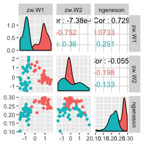
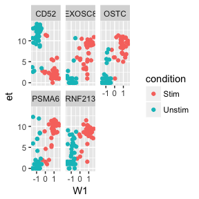
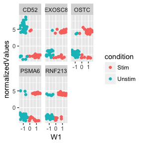

## Install some devel packages, load data.


```r
## BiocInstaller::biocLite(c("drisso/SingleCellExperiment",
## "RGLab/MAST@SingleCellExperiment",
## "drisso/zinbwave@SCE"))
library(MAST)
```

```
## Loading required package: SingleCellExperiment
```

```
## Loading required package: SummarizedExperiment
```

```
## Loading required package: GenomicRanges
```

```
## Warning: package 'GenomicRanges' was built under R version 3.4.1
```

```
## Loading required package: stats4
```

```
## Loading required package: BiocGenerics
```

```
## Loading required package: parallel
```

```
## 
## Attaching package: 'BiocGenerics'
```

```
## The following objects are masked from 'package:parallel':
## 
##     clusterApply, clusterApplyLB, clusterCall, clusterEvalQ,
##     clusterExport, clusterMap, parApply, parCapply, parLapply,
##     parLapplyLB, parRapply, parSapply, parSapplyLB
```

```
## The following objects are masked from 'package:stats':
## 
##     IQR, mad, sd, var, xtabs
```

```
## The following objects are masked from 'package:base':
## 
##     anyDuplicated, append, as.data.frame, cbind, colMeans,
##     colnames, colSums, do.call, duplicated, eval, evalq, Filter,
##     Find, get, grep, grepl, intersect, is.unsorted, lapply,
##     lengths, Map, mapply, match, mget, order, paste, pmax,
##     pmax.int, pmin, pmin.int, Position, rank, rbind, Reduce,
##     rowMeans, rownames, rowSums, sapply, setdiff, sort, table,
##     tapply, union, unique, unsplit, which, which.max, which.min
```

```
## Loading required package: S4Vectors
```

```
## 
## Attaching package: 'S4Vectors'
```

```
## The following object is masked from 'package:base':
## 
##     expand.grid
```

```
## Loading required package: IRanges
```

```
## Loading required package: GenomeInfoDb
```

```
## Loading required package: Biobase
```

```
## Welcome to Bioconductor
## 
##     Vignettes contain introductory material; view with
##     'browseVignettes()'. To cite Bioconductor, see
##     'citation("Biobase")', and for packages 'citation("pkgname")'.
```

```
## Loading required package: DelayedArray
```

```
## Loading required package: matrixStats
```

```
## 
## Attaching package: 'matrixStats'
```

```
## The following objects are masked from 'package:Biobase':
## 
##     anyMissing, rowMedians
```

```
## 
## Attaching package: 'DelayedArray'
```

```
## The following objects are masked from 'package:matrixStats':
## 
##     colMaxs, colMins, colRanges, rowMaxs, rowMins, rowRanges
```

```
## The following object is masked from 'package:base':
## 
##     apply
```

```
## 
## Attaching package: 'MAST'
```

```
## The following object is masked from 'package:stats':
## 
##     filter
```

```r
library(zinbwave)
library(magrittr)
library(ggplot2)
library(GGally)
library(dplyr)
```

```
## Warning: package 'dplyr' was built under R version 3.4.1
```

```
## 
## Attaching package: 'dplyr'
```

```
## The following object is masked from 'package:GGally':
## 
##     nasa
```

```
## The following objects are masked from 'package:MAST':
## 
##     combine, filter
```

```
## The following object is masked from 'package:matrixStats':
## 
##     count
```

```
## The following object is masked from 'package:Biobase':
## 
##     combine
```

```
## The following objects are masked from 'package:GenomicRanges':
## 
##     intersect, setdiff, union
```

```
## The following object is masked from 'package:GenomeInfoDb':
## 
##     intersect
```

```
## The following objects are masked from 'package:IRanges':
## 
##     collapse, desc, intersect, setdiff, slice, union
```

```
## The following objects are masked from 'package:S4Vectors':
## 
##     first, intersect, rename, setdiff, setequal, union
```

```
## The following objects are masked from 'package:BiocGenerics':
## 
##     combine, intersect, setdiff, union
```

```
## The following objects are masked from 'package:stats':
## 
##     filter, lag
```

```
## The following objects are masked from 'package:base':
## 
##     intersect, setdiff, setequal, union
```

```r
library(dtplyr)

knitr::opts_chunk$set(cache = TRUE, message = FALSE,error = FALSE,warning = FALSE)
```

Install some development packages.


```r
data(maits, package='MAST')
dim(maits$expressionmat)
unlog <- function(x) round(2^x - 1)
maits$fdata$primerid <- colnames(maits$expressionmat) <- make.names(maits$fdata$symbolid)
sca_raw <- FromMatrix(maits$expressionmat %>% t() %>% unlog() , maits$cdat, maits$fdat)
sca_filt <- sca_raw[freq(sca_raw)>.1,] %>% subset(., ourfilter)
sca_filt <- sca_filt[sample(nrow(sca_filt), 1500),]
```

These data are log2 + 1 transcripts per million (TPM), as output by RSEM--but other packages expect count-like data.


```r
zw <- zinbwave(Y = sca_filt, K = 2)
```

Run zinbwave on two factors


```r
ggpairs(data.frame(zw = reducedDim(zw), colData(zw)), columns = c('zw.W1', 'zw.W2', 'ngeneson'), mapping = aes(color = condition))
```

<!-- -->

## Using MAST to characterizing genes that drive the factors


```r
assays(zw)[[1]] <- log2(assay(zw)+1)
colData(zw) <- cbind(colData(zw), zw=as.data.frame(reducedDim(zw)))
zw <- zw %>% as('SingleCellAssay')
zz <- zlm(~W1+W2, sca=zw)
```


```r
ss <- summary(zz)
knitr::kable(print(ss))
```

Fitted zlm with top 2 genes per contrast:
( log fold change Z-score )
 primerid W1      W2     
 103910      6.5    -3.3*
 1043      -10.7*    1.6 
 58505       9.0*    0.4 
 STRF6      -3.3    -3.5*


primerid   W1       W2    
---------  -------  ------
103910     6.5      -3.3* 
1043       -10.7*   1.6   
58505      9.0*     0.4   
STRF6      -3.3     -3.5* 

These are log-fold changes in the top few changes associated with factors 1 and 2.


```r
top5 <- ss$datatable %>% filter(component=='logFC', contrast %like% 'W') %>% arrange(-abs(z)) %>% head(n=5) %>% left_join(rowData(zw) %>% as.data.table())
plt <- ggplot(zw[top5$primerid,] %>% as('data.table'), aes(x=W1, color = condition)) + geom_point() + facet_wrap(~symbolid)
```


```r
plt + aes(y = et)
```

<!-- -->

Expression on "Et" scale ($\log_2( TPM + 1)$)


```r
plt + aes(y = normalizedValues)
```

<!-- -->

Normalized expression from factor model

## Potential benefits:

*  Improve and speed analyses -- mix and match normalization methods,  dimensionality reduction, plotting
*  Improve statistical methods -- allow inter-method comparison
*  Improve software -- write utility functions once, and well

## Potential pitfalls:

*  What is in slot 1 of assays? Counts? Normalized counts? Log-transformed?
*  Implicit contracts between functions (load -- normalize -- analysis )
*  Idiosyncratic results ( analysis -- plot )

# SingleCellExperiment: ask for it from your local bioinformatic package today! #
